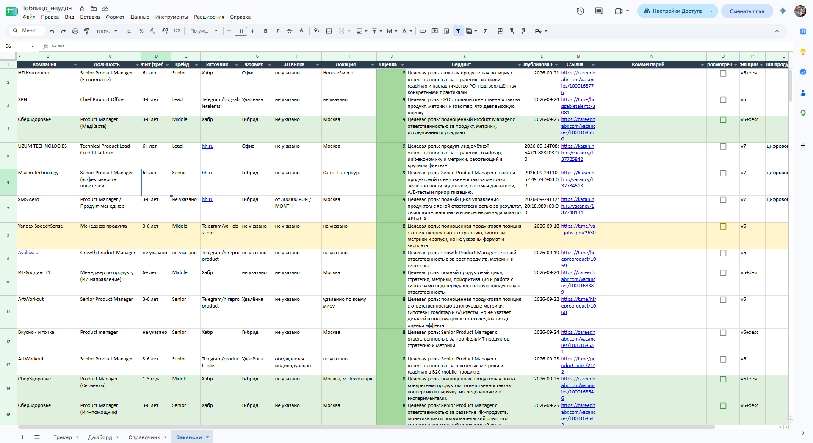
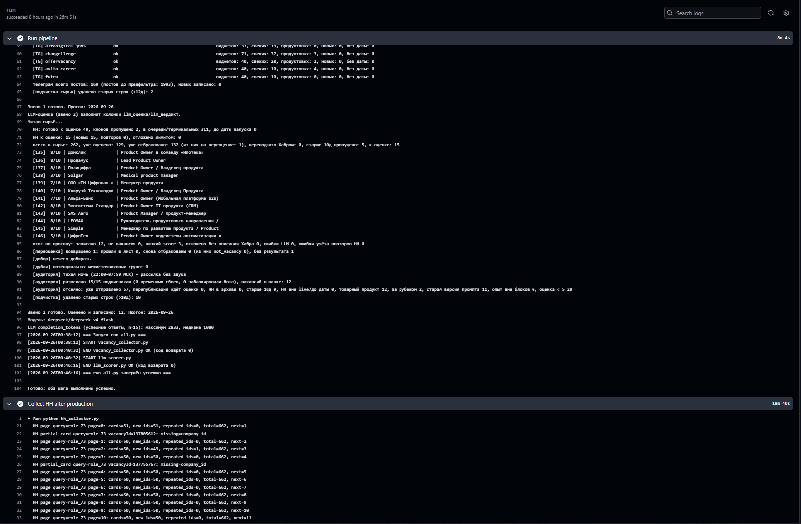
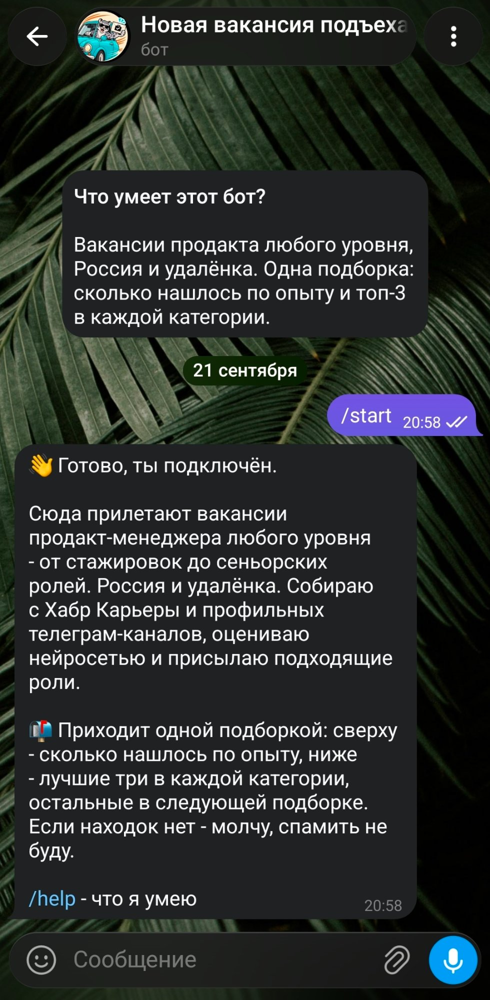
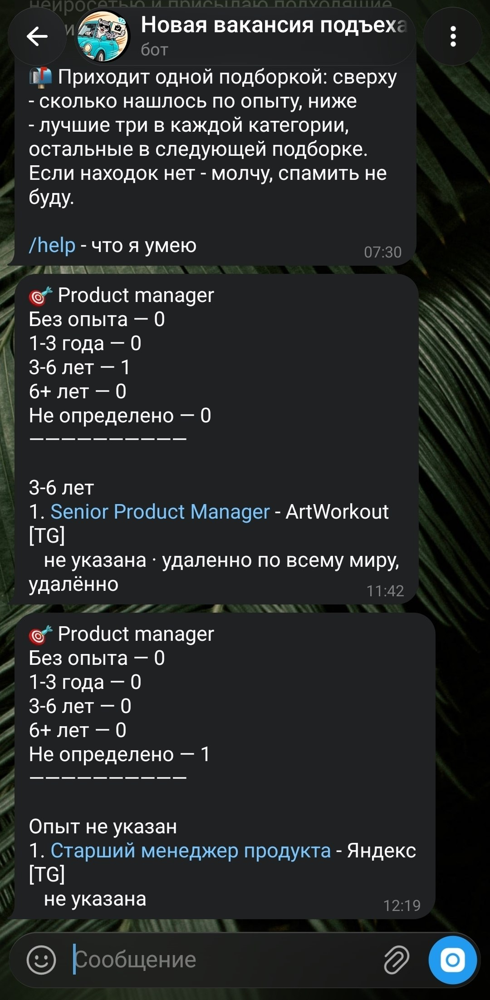
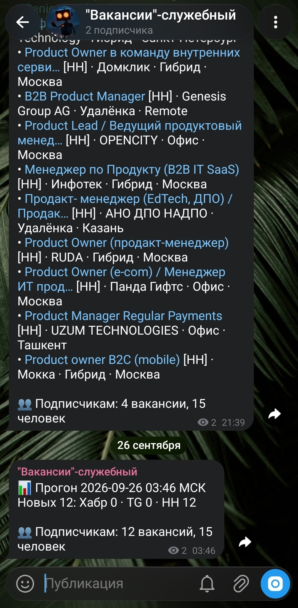

# Новая вакансия подъехала

Началось как личный скрипт: надоело вручную просматривать десятки телеграм-каналов в поисках первой роли в продукте. Закончилось телеграм-ботом, которым пользуюсь не только я.

Собирает вакансии с hh.ru, Хабр Карьеры и 38 телеграм-каналов, прогоняет через нейросеть, складывает в таблицу и дважды в день присылает подходящее в телеграм. Крутится в облаке само, компьютер включать не нужно.



Ниже - не описание готовой архитектуры, а история, как она такой стала. Почти каждое решение здесь переделывалось минимум один раз, и обычно потому, что данные не совпали с тем, что я думал.

Бот меняется быстрее, чем я успеваю переписывать этот README: приоритет всегда у рабочего бота, а не у синхронности документации с ним.

## Проблема

Искать первую роль в продукте - это подписаться на кучу каналов и постоянно высматривать в них своё. Телеграм захламляется, поток идёт вперемешку, и почти всё в нём - не твоё. Senior-позиции, вакансии не про продукт, реклама курсов.

- **Где вообще смотреть?** hh.ru закрыл соискательский API - официально «поддержка прекращена 15 декабря 2025», по факту доступ отвалился весной 2026. Надолго остались агрегаторы в телеграме и career-площадки; hh.ru вернулся в источники позже, отдельным звеном.
- **Как отличить своё от чужого?** мне, junior, не нужны Middle и Senior, но в ленте они вперемешку с подходящим.
- **Одно и то же по пять раз.** каналы репостят друг друга, одна вакансия прилетает из кучи мест.

## Как это работает сейчас

```
Откуда беру
  ├── hh.ru
  ├── Хабр Карьера
  └── 38 телеграм-каналов
        │
        v
Собираю ─────── выкидываю явно не то, склеиваю повторы,
  │             отбрасываю всё старше 10 дней;
  │             hh.ru - сначала свежие, товарные роли отсекаю по названию
  v
Оценивает нейросеть ── балл 0-10, вердикт, тип продукта и география
  │
  v
Таблица ─────── что прошло по баллу - падает сюда, лучшее сверху
  │
  v
Телеграм ────── подписчикам - подборка в бота, мне - сводка цифрами и тревоги
```

Запускается по расписанию через GitHub Actions дважды в день - утром и ближе к вечеру. Время подобрано по данным: hh.ru публикует вакансии в основном с 10 до 18, и дневной запуск забирает около 80% дневного потока в тот же день. Утренний подбирает вечер и ночь. Если какой-то запуск пропустили (у бесплатного крона такое бывает), следующий доберёт неотправленное - повторно ничего не уйдёт.

Кроме расписания, прогон можно запустить вручную - в том же облаке или на своём компьютере. Облачный запуск предпочтительнее: настройки хранятся в одном месте, и два прогона не могут наложиться друг на друга. Локальный нужен для отладки, когда надо видеть процесс вживую.

Отдельной тестовой среды нет: любой запуск боевой - пишет в те же таблицы и рассылает тем же подписчикам. Это осознанный компромисс: второй контур удвоил бы настройки и секреты ради проекта, который ведёт один человек. Цена - дисциплина: не запускать руками рядом с плановым временем и проверять изменения тестами до выкладки.

Живой прогон в облаке:



В этом прогоне сборщик просмотрел 251 карточку Хабра и 1993 поста в телеграм-каналах, продуктовый предфильтр оставил 35 и 169. Это объём окна источников, а не число новых вакансий: всё подходящее оттуда уже было оценено на предыдущих заходах. Новое принёс hh.ru - 15 вакансий на оценку: 12 прошли по баллу, 3 отсеялись. Подписчикам ушла подборка из 12 вакансий. На этапе рассылки фильтры отсекли 12 вакансий с товарным продуктом и 2 с офисом за рубежом. Ниже - отдельный шаг сбора hh.ru: он обходит поисковую выдачу постранично и пополняет очередь, из которой следующий прогон берёт вакансии на оценку.

## Что переделывалось и почему

### Порог: симптом указывал не туда

Первая версия писала в таблицу всё подряд и слала в телеграм всё, что выше минимального балла. В боте оказался мусор: Senior, Project Manager, вакансии не про продукт.

Очевидная гипотеза - нейросеть плохо оценивает. Проверил: взял то, что она забраковала, и перечитал руками. Оценивала честно, везде опыт от года-двух или Senior.

Причина была в другом месте: порог показа в боте стоял на том же значении, что порог записи в таблицу. Всё, что годилось для «посмотреть потом», летело в уведомление. Развёл два порога: в таблицу - от 3 баллов, в бота - от 5. Мусор остался в таблице, где ему и место.

### Дедуп, который выглядел рабочим

В таблице копились дубли. Дедуп по отпечатку вакансии был написан и на вид работал.

Оказалось, в листе была скрытая колонка, и запись уходила со сдвигом на одну позицию: отпечаток ложился не в ту ячейку. Проверка искала его там, где его никогда не было, и каждый раз честно отвечала «такого нет».

Ошибок нет, логи чистые, всё «работает» - поломка была молчаливой. Нашёл только потому, что полез смотреть глазами, что реально лежит в ячейках. Пары дней хватило, чтобы дублей набралось заметно.

### Хабр: три гипотезы, ни одна не подтвердилась

Хабр давал 2-4 вакансии за прогон при сотнях из телеграма. Списывал на бедность источника.

Когда дошли руки, выдвинул три версии: сломался парсер, слишком жёсткий предфильтр, или на Хабре правда ничего нет. Не подтвердилась ни одна.

В адресе запроса к Хабру остались параметры «Казань + Москва + удалёнка» - от старой версии, когда я искал только по этим городам. Профиль давно сменился на «вся Россия и удалёнка», это было прописано в задании для нейросети, но в сборщике осталось по-старому. Рассинхрон между двумя звеньями, который не проявлялся как ошибка - просто половина рынка не доезжала до оценки.

Убрал фильтр: сбор вырос с 2 до 37 вакансий за прогон (249 карточек до отсева).

Отдельный урок для меня: пока разбирались, я дважды принёс цифры, которые ничего не доказывали - смотрел выдачу Хабра в браузере, а не тем запросом, которым ходит код. Проверять надо тем же путём, которым ходит система, иначе меряешь не то.

### Лимит, который тихо резал недоставленное

В таблице стоял предел на количество строк - страховка от бесконечного роста. Раньше он не срабатывал, потому что вакансий было мало.

После расширения Хабра поток вырос, и обнаружилось: при переполнении лимит резал строки, ничего не зная о том, ушли они подписчикам или ещё ждут своей очереди. За прогон рассылается не больше десяти вакансий, остальные ждут следующего - и могли быть удалены раньше, чем дойдёт очередь. Не дубль у людей, а тихая потеря: вакансия исчезала и до них не доходила вовсе.

Нашли на 144 строках из 150, за пару дней до срабатывания.

Можно было поднять лимит - и это был бы ремонт симптома. Вместо этого лимит научился знать о доставке: строки, которые ещё не ушли подписчикам и прошли по баллу, обрезке не подлежат.

### hh.ru: поток в пять раз больше, чем успеваю переварить

Первый же день с hh.ru дал около 200 вакансий продакт-менеджера. Для честной оценки нужно полное описание вакансии, а это отдельный запрос на каждую - за прогон их немного. Выходило около 30 описаний в сутки против 150-200 новых вакансий.

Очередь шла от старых к новым - казалось справедливым. Но при нехватке мощности это значит: через неделю бот разбирал бы вакансии возрастом 9-10 дней, а свежие ждали бы, пока устареют. Подписчик получал бы то, на что уже откликнулись все.

Сделал две вещи. Развернул очередь: сначала новые - если что-то и не успеваем, пусть это будут старые. И добавил дешёвый предфильтр до запроса описания: нейросеть по названию и компании отсекает роли про физический товар - одежду, бытовую химию, оборудование. Таких оказалась треть потока. Предфильтр пока работает в режиме наблюдения: записывает решения, но ничего не отсекает. Доверю ему отбор, когда сверю его решения с полной оценкой.

### Опыт: нейросеть угадывала то, что работодатель уже написал

Разбирая подборку, увидел вакансию с требованием «3-6 лет» в блоке «1-3 года». Опыт для блоков определяла нейросеть по тексту описания. А у hh.ru требование к опыту - отдельное поле, которое заполняет сам работодатель.

Сверил: нейросеть расходилась с работодателем в каждой четвёртой вакансии, 9 из 39. Теперь для hh.ru опыт берётся из поля работодателя, нейросеть - только если поле пустое. Урок: не заставлять модель угадывать то, что уже лежит в данных.

### Расписание: ночные запуски под дневной рынок

Запуски стояли ночью - чтобы подборка ждала утром. Посмотрел, когда hh.ru публикует вакансии: почти всё - с 10 до 18. Вакансия, вышедшая в 11 утра, доходила до подписчика только следующей ночью, через 14 часов. В поиске работы ранний отклик заметнее, так что полдня задержки - прямой минус для пользователя.

Перенёс запуски на утро и конец рабочего дня: дневной забирает около 80% дневного потока в тот же день, утренний - вечер и ночь.

## Личный инструмент стал продуктом

До какого-то момента это был скрипт для одного человека. Потом стало понятно, что та же боль есть у всех, кто ищет первую роль в продукте, - а у меня уже работающий конвейер.



Что пришлось решить, чего не было в личной версии:

**Доступ.** Бот открыт участникам моего телеграм-канала. Не жёсткое требование, а условие обмена: человек видит отказ со ссылкой и решает сам. Тихий отказ вместо навязчивого «подпишись».

**Одна лента на всех или своя каждому.** Персонализация выглядела правильнее, но означала анкету, хранилище профилей и вызовы нейросети на каждого подписчика - то есть другой продукт. Выбрал одну ленту: масштабируется почти бесплатно, потому что оценка вакансии делается один раз независимо от числа получателей. Персонализацию отложил осознанно, а не забыл.

**Где живёт бот.** Для входящих сообщений нужен постоянно доступный процесс - крон GitHub для этого не годится, он умирает между запусками. Взял serverless: бот просыпается только на входящее сообщение и укладывается в бесплатный лимит. Рассылка при этом осталась там, где была - в облачном расписании. Две части развязаны и общаются по защищённому адресу.

**Тексты писал раньше кода.** Всё, что бот говорит - приветствие, отказ, справку, ответ на непонятную команду, - сформулировал до того, как это программировалось. Человек, который ещё не подписан, видит от продукта ровно одно сообщение: отказ. Если в нём не сказано, что делать дальше, он просто закроет бота и не вернётся. Поэтому в отказе есть ссылка на канал и прямая инструкция нажать /start ещё раз.



## Главный риск оказался не в функциональности

Когда у продукта появились живые пользователи, стало видно главное: система умеет ломаться беззвучно. И дедуп, и фильтр Хабра ломались именно так - ошибок в логах не было, всё выглядело рабочим. Пока пользовался один я, это стоило мне пропущенной вакансии. С людьми цена другая.

Что сделал:

**Детектор аномалии сбора.** Система сравнивает, сколько карточек собрала, со средним за последние прогоны. Резкое падение или ноль - сообщение мне. Порог считается по собранным карточкам, а не по прошедшим отбор: вторые естественно скачут день ото дня, и алерт на них орал бы постоянно.

**Сообщения о сбоях.** Раньше падение скрипта в облаке можно было заметить, только заглянув в логи. Теперь оно приходит в телеграм. Со звуком - только то, что требует действия; обычная сводка прогона приходит беззвучно. Иначе к тревогам привыкаешь и перестаёшь их замечать.



*Служебный канал. Сверху - как было: после каждого прогона список всех новых вакансий. Снизу - как стало: одна беззвучная сводка цифрами - сколько новых и из каких источников, сколько ушло подписчикам.*

Список казался полезным, но на деле дублировал то, что я и так получаю в бота как подписчик. Каждый прогон - длинное сообщение со звуком, и среди них легко пропустить настоящую тревогу. Сократил до цифр: они показывают, жив ли конвейер и не выдохся ли какой-то источник. Со звуком теперь приходит только то, что требует действия: сбои, отписки, проблемы с приёмом сообщений ботом.

**Версия задания для нейросети.** Промпт правился несколько раз. Рядом с каждой оценкой теперь пишется версия - иначе при просадке качества нечем понять, от какой правки.

**Движение подписчиков.** Подключения и отписки приходят счётчиком, без личных данных: «+1, всего N». Считаются и отказы на входе - сколько людей дошло до бота, но не стало подписываться. Это разные выводы: «пост не сработал» и «пост сработал, но условие отпугнуло». Отписки приходят отдельным сообщением: отток - главный сигнал, что с частотой или объёмом подборок я перегнул.

## Безопасность

У бота есть ключ к нейросети, токен телеграма и доступ к моим таблицам - попади это к постороннему, он получит и мой доступ, и мои деньги на счету нейросети. Поэтому в коде только названия секретов, не значения: локально в файле, который не уходит в общий доступ, в облаке - в защищённом хранилище.

Адреса, доступные из интернета, закрыты отдельными секретами - каждый своим, чтобы утечка одного не открывала остальные. О пользователях не хранится ничего лишнего: только идентификатор и статус подписки, ни имён, ни переписки.

## На чём собрано

Python, нейросеть через OpenRouter, Google Таблицы, расписание через GitHub Actions, телеграм-бот. Часть, отвечающая на входящие сообщения, - на Cloudflare Workers с их же key-value хранилищем.

Выбор дешёвой модели вместо топовой - осознанный: на потоке в тысячи постов разница в качестве не стоит цены. Отсев работает не за счёт ума модели, а за счёт того, что до неё доходит уже отфильтрованное.

## Решения и почему так

| Решение | Как ещё можно было | Почему выбрал это |
|---|---|---|
| Оценка нейросетью | Фильтр по словам | Слова не отличают junior-вакансию от Senior с тем же названием |
| Два разных порога: в таблицу и в бота | Один общий порог | Общий порог гнал в уведомления всё, что годилось «посмотреть потом» |
| Одна лента на всех | Свой профиль каждому | Персонализация - другой продукт: анкета, хранилище, оценка на каждого |
| Гейт по подписке на канал | Открытый доступ | Условие обмена, понятное обеим сторонам; отказ тихий, без давления |
| Дедуп по вакансии | Дедуп по паре «человек + вакансия» | Лента одна на всех - хранить пары незачем, а стоило бы дороже |
| Лимит строк, знающий о доставке | Просто поднять лимит | Поднять - отложить проблему; причина была в том, что лимит не знал о доставке |
| Google Таблица как экран | База данных + сайт | Ноль возни: открыл ссылку, галочкой отметил просмотренное |
| Serverless для входящих | Постоянный сервер | Бот просыпается на сообщение; при этих объёмах укладывается в бесплатный лимит |
| Дешёвая модель | Дорогая топовая | На потоке в тысячи постов разница в качестве не стоит цены |
| Опыт для hh.ru - из поля работодателя | Оценка нейросети по тексту | Нейросеть расходилась с работодателем в каждой четвёртой вакансии |
| Очередь hh.ru - от новых к старым | От старых к новым | При нехватке мощности теряться должны старые вакансии, а не свежие |
| Предфильтр по названию до запроса описания | Запрашивать описание каждой | Описания - самый дефицитный ресурс, а треть потока - товарные роли |
| До пяти вакансий в блоке | Три | Три прятали хорошие вакансии: подписчик видел «показано 1 из 8» |
| Запуски утром и в конце рабочего дня | Ночью, чтобы подборка ждала утром | hh.ru публикует днём - ночные запуски давали задержку до 14 часов |
| Сводка владельцу - цифрами и без звука | Список вакансий | Список дублировал бота, а шум приучает не замечать тревоги |

## Как это делалось

Код писал в связке с ИИ - без него ушли бы недели. Но инструмент не отменяет мышления: почти всё время заняла не сборка, а отладка, и находить настоящую причину, а не симптом, приходилось самому.

Сквозная линия всей этой истории: **симптом почти никогда не указывает туда, где причина.** Мусор в боте выглядел как проблема нейросети - оказался порогом. Дубли выглядели как сломанный дедуп - оказались скрытой колонкой. Бедность Хабра выглядела как бедность источника - оказалась забытым фильтром по городам. Путаница в блоках опыта выглядела как ошибка нейросети - оказалось, я заставлял её угадывать то, что работодатель уже написал.

Каждый раз спасало одно и то же: не чинить по догадке, а сначала посмотреть на данные. И проверять их тем же путём, которым ходит система, - иначе меряешь не то, что работает.

## В какой момент код стал закрытым

Пока всё было личным экспериментом, открытый репозиторий работал как дневник разработки. Потом у бота появились реальные подписчики, регулярная рассылка и рабочий облачный контур. Эксперимент начал приносить пользу и стал продуктом.

Вместе с кодом в открытом доступе лежала почти готовая инструкция по запуску такого же сервиса: источники, правила отбора, промпты, дедупликация, доставка и мониторинг. Все основные грабли уже были собраны — оставалось заменить токены и придумать название.

Поэтому рабочее ядро я закрыл, а подробную историю, цифры и выводы оставил здесь. Сам бот остаётся бесплатным. Пользоваться результатом можно без оплаты; создавать аналогичный продукт — уже со своими гипотезами, решениями и граблями.

## Автор

Андрей · Телеграм: [@Aysvoch](https://t.me/Aysvoch) · Канал: [Приватный эфир](https://t.me/Private_ether) · Бот: [@vakansiya_podehala_bot](https://t.me/vakansiya_podehala_bot)

---

© 2026 Андрей Салиев
