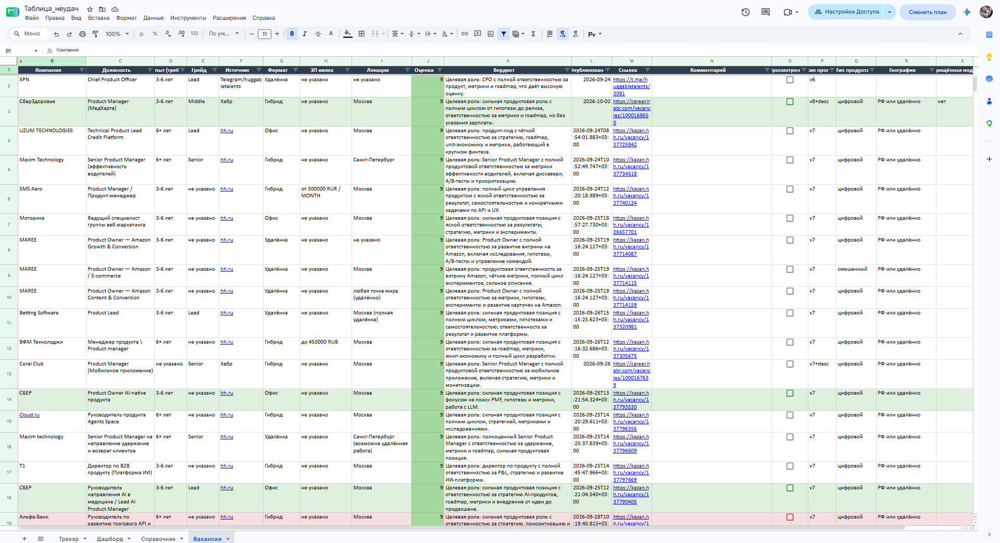
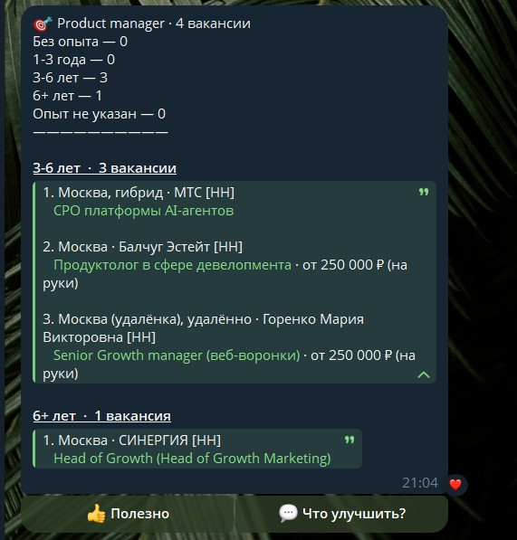
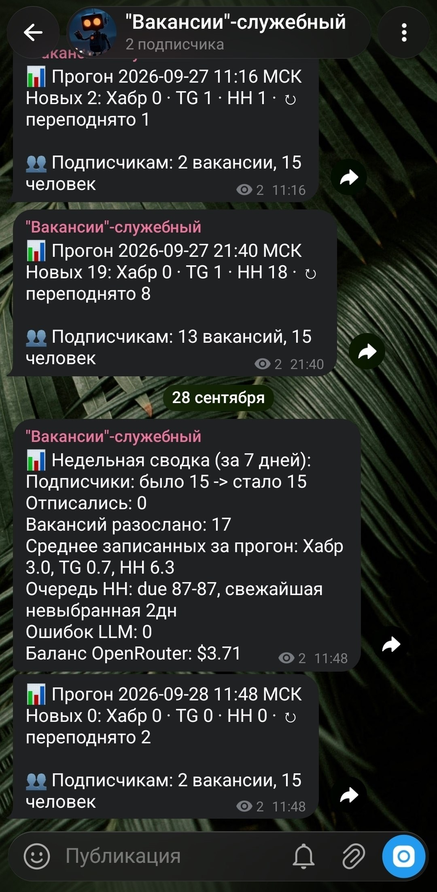

# Новая вакансия подъехала

**Телеграм-бот с вакансиями для продакт-менеджеров. Сам собирает их из 40 источников, отбирает нейросетью (LLM) и дважды в день присылает подписчикам лучшее - без дублей и мусора.**

Начиналось как личный скрипт: надоело вручную листать десятки каналов в поисках первой роли в продукте. Сейчас это работающий продукт с подписчиками, который живёт в облаке сам. Я вёл его как продакт: формулировал гипотезы, ставил задачи, принимал решения по данным. Код писал ИИ по моим ТЗ.



## Коротко в цифрах

| | |
|---|---|
| Источники | hh.ru, Хабр Карьера, 38 телеграм-каналов, страницы вакансий по ссылкам из постов |
| Объём за прогон | ~430 карточек Хабра, ~1900 постов телеграма, ~750 вакансий в выдаче hh.ru |
| Оценка нейросетью | медиана 7,9 с на вакансию (было 25,7), 1-2 цента за прогон |
| Подписчики | 19, отписок нет |
| Качество кода | более 550 автотестов, проверка на каждый push, скан истории на секреты |

## Как это работает

```
Источники: hh.ru · Хабр · 38 телеграм-каналов
    │
    v
Сбор и грубый отсев ── только продуктовые роли по названию, не старше 10 дней;
    │                  hh.ru: возраст по дате создания, очередь описаний -
    │                  сначала вакансии для начинающих и свежие
    v
Добор описаний ─────── короткий пост из телеграма -> описание со страницы вакансии
    │
    v
Оценка нейросетью ──── балл 0-10, опыт, тип продукта, география, запрещённые индустрии
    │
    v
Таблица ────────────── всё прошедшее, лучшее сверху
    │
    v
Рассылка ───────────── блоки по опыту, без повторов и дублей из разных каналов;
                       мне - сводка цифрами и тревоги только по делу
```

Запускается по расписанию в GitHub Actions. Бот для подписки - отдельный serverless-сервис на Cloudflare Workers: просыпается только на входящее сообщение и укладывается в бесплатный лимит.



## Продуктовые решения

| Решение | Альтернатива | Почему так |
|---|---|---|
| Одна лента на всех | Свой профиль каждому | Персонализация - это другой продукт: анкета, хранилище профилей, оценка на каждого. Отложил осознанно |
| Оценка нейросетью | Фильтр по словам | Слова не отличают junior от Senior с тем же названием |
| Грубый фильтр на входе - максимально широкий | Строгий фильтр | Лишнее отсеет нейросеть, а потерянное на входе уже не вернуть |
| Опыт - строже из двух: поле работодателя и текст описания | Верить одному источнику | Ошибаются оба; заниженный опыт обманывает самых уязвимых - людей без опыта |
| Возраст hh.ru - по дате создания | По дате публикации | «Поднятые» вакансии выглядели свежими: подписчикам уходили вакансии возрастом до 108 дней |
| Очередь описаний: сначала начинающие и свежие | От старых к новым | Описаний на всех не хватает - пусть теряются старые и сеньорские |
| Тип продукта - по тому, что развивает роль | По тому, что продаёт компания | Цифровая роль в ритейле - продуктовая; роль про товарную линейку - нет |
| Без adult и азартных игр | Любая продуктовая роль | Лента - лицо канала |
| Дешёвая модель | Топовая | На тысячах постов разница в качестве не стоит цены: отсев держится на конвейере, а не на уме модели |
| Сводка владельцу цифрами и без звука | Список вакансий | Шум приучает не замечать настоящие тревоги |

## Сложное, что пришлось решить

Главный урок проекта: **симптом почти никогда не указывает туда, где причина.** Самые дорогие поломки были беззвучными - ошибок в логах нет, всё «работает», а вакансии теряются.

- **Мусор в ленте.** Выглядело как слабая нейросеть. Перечитал забракованное руками - оценивала честно. Причина: порог показа в боте совпадал с порогом записи в таблицу. Развёл пороги.
- **Дубли при работающем дедупе.** Скрытая колонка в таблице сдвигала запись на одну ячейку: проверка искала отпечаток не там и честно отвечала «такого нет». Нашёл, только посмотрев глазами на ячейки.
- **Хабр давал 2-4 вакансии.** Три гипотезы - ни одна. В запросе остался старый фильтр по городам. Убрал: сбор вырос до ~37 продуктовых за прогон.
- **Старые вакансии под видом свежих.** Работодатели «поднимают» вакансии. Из 41 вакансии hh.ru, ушедшей подписчикам, 20 были созданы 12-108 дней назад. Требование «считать по дате создания» я ставил сразу - оно потерялось при реализации.
- **Короткие анонсы.** Посты вида «роль + ссылка» нейросеть оценивала на 4-5 из-за отсутствия описания. Теперь описание подтягивается со страницы вакансии по ссылке: в первом же прогоне 8 таких вакансий переоценены, баллы выросли до 6-9.
- **Одна вакансия - дважды в подборке.** Сеть каналов репостит один пост. Добавил склейку по «компания + должность» между разными источниками - и не внутри одного, чтобы не склеить две разные вакансии Яндекса с одинаковым названием.
- **Весь сбор hh.ru падал из-за 4 карточек из 650.** Выдача сдвигалась во время обхода страниц, строгая проверка полноты роняла шаг целиком. Сделал допуск в 1% с повторным проходом.
- **Метрика, которая врала.** Независимый аудит нашёл: «Разослано» считало выбранные вакансии, даже когда рассылка не состоялась. Теперь отдельно: выбрано, доставлено, подтверждено.

## Надёжность

Продукт должен жить сам: мне приходят только сигналы, которые требуют действия.

- **Сбор под наблюдением.** Резкое падение объёма по источнику или каналу - тревога; сравнение идёт со средним за прошлые прогоны.
- **Сторож пропущенных запусков.** Если плановый прогон не случился, приходит сообщение.
- **Проверка приёма сообщений ботом.** Однажды бот тихо перестал получать /start - теперь это ловится автоматически.
- **Частичные сбои без потерь.** Временная ошибка источника или сети не превращает вакансию в окончательный отказ - она повторяется в следующем прогоне.
- **Независимый аудит.** Второй ИИ проверил весь конвейер; находки я сверил с кодом и данными, подтверждённые исправлены.



## Безопасность

- Секреты только в защищённых хранилищах, в коде - одни названия. Каждый push проверяется на утечки, история репозитория сканируется целиком.
- Текст вакансий и страниц считается недоверенным: защита от внедрения инструкций в нейросеть (prompt injection), загрузка страниц только по безопасным внешним адресам, с лимитами размера и времени.
- ИИ, который пишет код, работает под техническим замком: не может прочитать файлы с ключами, запустить боевой прогон или ослабить собственные ограничения.
- О подписчиках хранится минимум: идентификатор и статус подписки. В служебные сообщения идентификаторы не попадают.

## Как это делалось

Роли: я - продакт и архитектор, код пишет ИИ по моим ТЗ, второй ИИ выступает ревьюером. Каждое изменение проходит один цикл: ТЗ с критериями приёмки -> код и тесты -> независимая проверка на копии -> боевой прогон -> разбор данных -> следующее решение.

Инструмент не отменяет мышления: больше всего времени ушло не на сборку, а на поиск настоящих причин. Работало одно правило - не чинить по догадке, а сначала смотреть на данные тем же путём, которым ходит система.

**Что дальше.** Две недели наблюдения по критериям остановки: ноль дефектов у подписчиков, тревоги только по делу, полнота и точность отбора не ниже 90% на выборке. После - заморозка функциональности и переход к главной метрике: помогает ли бот откликнуться и получить собеседование.

## Почему код закрыт

Пока проект был экспериментом, репозиторий был открытым дневником разработки. Когда появились подписчики, в открытом доступе оказалась почти готовая инструкция по запуску такого же сервиса. Рабочее ядро я закрыл, историю, решения и цифры оставил здесь. Бот остаётся бесплатным.

## Автор

Андрей · Телеграм: [@Aysvoch](https://t.me/Aysvoch) · Канал: [Приватный эфир](https://t.me/Private_ether) · Бот: [@vakansiya_podehala_bot](https://t.me/vakansiya_podehala_bot)

---

© 2026 Андрей Салиев
